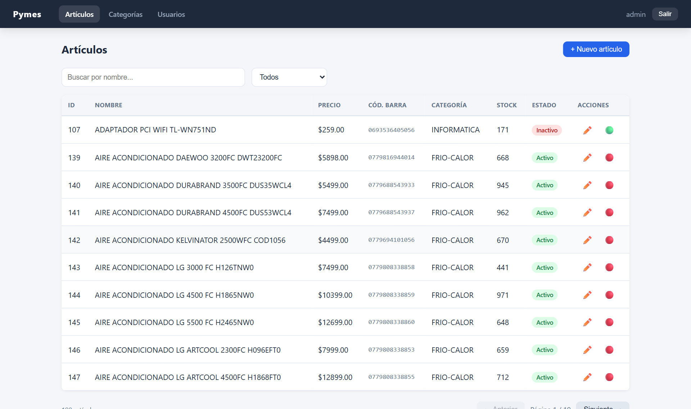
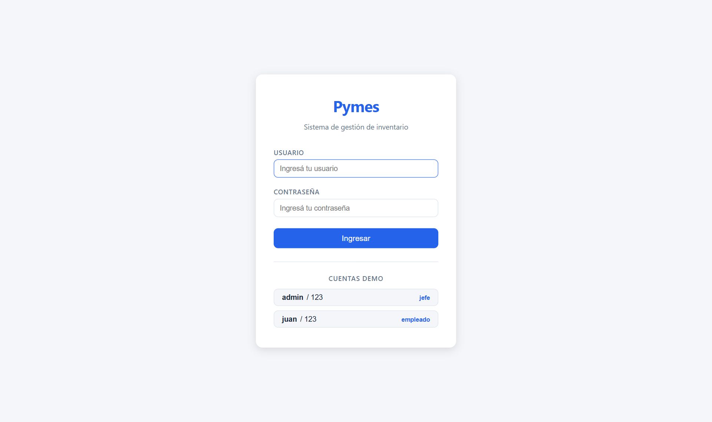
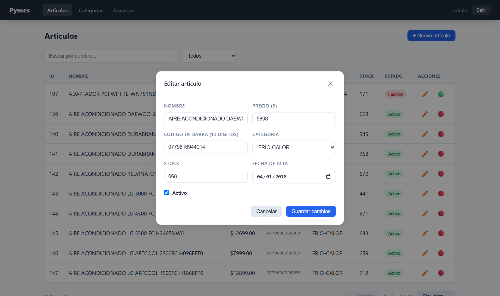
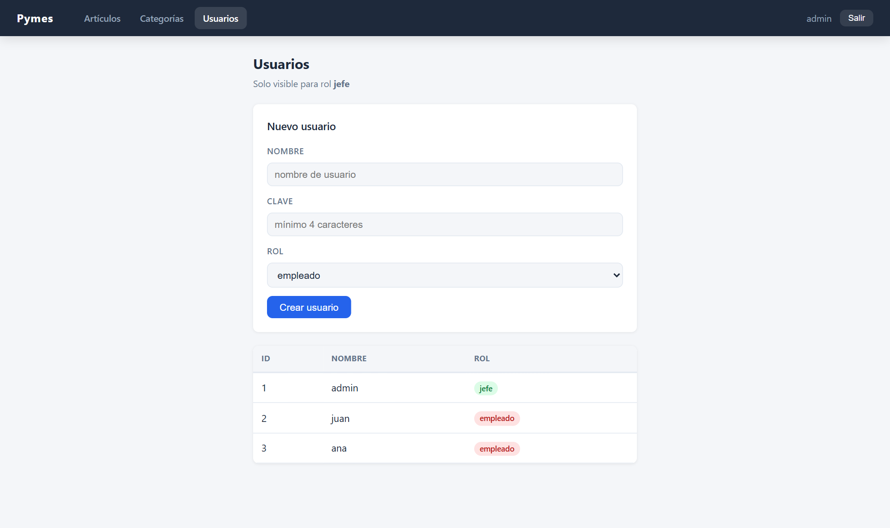
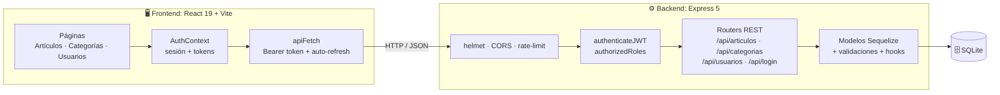
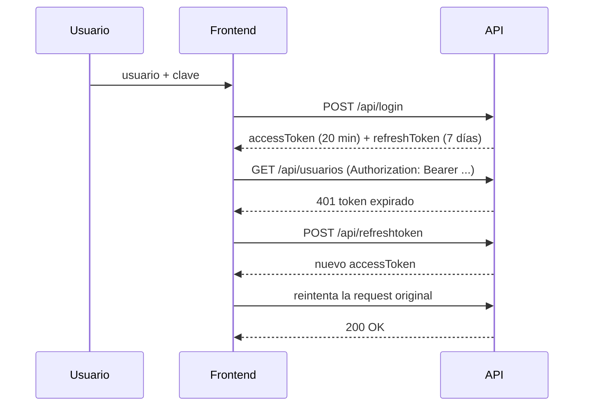

<div align="center">


# Pymes · Gestión de Inventario

**Aplicación full-stack para que pequeñas y medianas empresas gestionen su catálogo de productos, categorías y usuarios, con autenticación JWT y control de acceso por roles.**

[](https://github.com/Alelavini/Pyme/actions/workflows/ci.yml)


[Inicio rápido](#-inicio-rápido) ·
[Funcionalidades](#-funcionalidades) ·
[Arquitectura](#-arquitectura) ·
[API](#-api-rest) ·
[Seguridad](#-seguridad) ·
[Tests](#-tests)

<br />



</div>

---

## ⚡ Inicio rápido

> **Cero configuración.** La base de datos se crea y se carga con datos de ejemplo automáticamente en el primer arranque.

### Opción A: Docker (un solo comando)

```bash
git clone https://github.com/Alelavini/Pyme.git && cd Pyme
docker compose up --build
```

Abrí **http://localhost:3000** 🎉

### Opción B: Node.js (requiere Node 20 o superior)

```bash
git clone https://github.com/Alelavini/Pyme.git && cd Pyme
npm run setup   # instala dependencias de la raíz, el backend y el frontend
npm run dev     # levanta API (puerto 3000) y frontend (puerto 5173) en paralelo
```

Abrí **http://localhost:5173** 🎉

### 🔑 Cuentas demo

La pantalla de login tiene botones para completar estas credenciales con un click:

| Usuario | Clave | Rol | Permisos |
|---------|-------|-----|----------|
| `admin` | `123` | **jefe** | Todo, incluida la gestión de usuarios |
| `juan`  | `123` | empleado | Artículos y categorías |

<details>
<summary><b>Todos los scripts disponibles</b></summary>

| Comando | Qué hace |
|---------|----------|
| `npm run setup` | Instala las dependencias de todo el monorepo |
| `npm run dev` | API con hot-reload (nodemon) + frontend con HMR (Vite) |
| `npm start` | Compila el frontend y lo sirve desde la API en `:3000` (modo producción) |
| `npm test` | Corre la suite de tests de la API (Jest + Supertest) |
| `npm run lint` | ESLint sobre el frontend |
| `npm run db:reset` | Borra la base SQLite y la vuelve a cargar con los datos de ejemplo |

</details>

---

## ✨ Funcionalidades

- 📦 **Gestión de artículos (CRUD completo)**: alta, edición y baja lógica (activar/desactivar) de 190 productos de ejemplo.
- 🔎 **Búsqueda y filtros del lado del servidor** por nombre y estado, con **paginación**.
- 🏷️ **Categorías** asociadas a cada artículo.
- 👥 **Gestión de usuarios** restringida al rol `jefe`, con hashing de contraseñas.
- 🔐 **Autenticación JWT** con *access token* de corta duración (20 min) y *refresh token* (7 días), con **renovación automática y transparente** en el cliente.
- 🛡️ **Autorización por roles (RBAC)** mediante middlewares reutilizables.
- ✅ **Validaciones en el modelo**: nombre único, código de barras EAN-13, campos requeridos, normalización a mayúsculas mediante hooks.
- 🧪 **Tests de integración** de la API y **CI en GitHub Actions**.
- 🐳 **Dockerizado** con build multi-stage: una sola imagen sirve la API y la SPA.

<table>
  <tr>
    <td width="50%"></td>
    <td width="50%"></td>
  </tr>
  <tr>
    <td align="center"><sub><b>Login</b> con acceso rápido a cuentas demo</sub></td>
    <td align="center"><sub><b>Edición</b> de artículos en un modal con validaciones</sub></td>
  </tr>
  <tr>
    <td width="50%"></td>
    <td width="50%"></td>
  </tr>
  <tr>
    <td align="center"><sub><b>Usuarios</b>: sección exclusiva del rol jefe</sub></td>
    <td align="center"><sub><b>Artículos</b> con búsqueda, filtros y paginación</sub></td>
  </tr>
</table>

---

## 🏗 Arquitectura



**Flujo de autenticación**



En desarrollo, Vite hace de *proxy* de `/api` hacia el backend; en producción (`npm start` o Docker) Express sirve el build de React y la API **desde el mismo origen**.

### Estructura del proyecto

```
Pyme/
├── backend/                  API REST (Node.js + Express 5)
│   ├── index.js              Servidor: middlewares, rutas y SPA estática
│   ├── config.js             Configuración centralizada (variables de entorno)
│   ├── auth.js               Middlewares JWT y autorización por roles
│   ├── models/               Modelos Sequelize + seed de la base de datos
│   ├── routes/               Endpoints: artículos, categorías, usuarios, seguridad
│   └── test/                 Tests de integración (Jest + Supertest)
├── frontend/                 SPA (React 19 + Vite + React Router 7)
│   └── src/
│       ├── api/client.js     Wrapper de fetch con JWT y refresh automático
│       ├── context/          AuthContext (estado de sesión)
│       ├── components/       Navbar, Modal, ProtectedRoute
│       └── pages/            Login, Artículos, Categorías, Usuarios
├── .github/workflows/ci.yml  Pipeline: tests, lint, build y build de Docker
├── Dockerfile                Build multi-stage (frontend + backend)
└── docker-compose.yml
```

---

## 🔌 API REST

| Método | Endpoint | Auth | Descripción |
|--------|----------|:----:|-------------|
| `POST` | `/api/login` | | Devuelve `accessToken` y `refreshToken` |
| `POST` | `/api/refreshtoken` | | Emite un nuevo `accessToken` |
| `POST` | `/api/logout` | | Invalida el `refreshToken` |
| `GET` | `/api/articulos?Nombre=&Activo=&Pagina=` | | Listado paginado con filtros |
| `GET` | `/api/articulos/:id` | | Detalle de un artículo |
| `POST` | `/api/articulos` | 🔒 | Alta de artículo |
| `PUT` | `/api/articulos/:id` | 🔒 | Modificación de artículo |
| `DELETE` | `/api/articulos/:id` | 🔒 | Baja lógica (activa/desactiva) |
| `GET` | `/api/categorias` | | Listado de categorías |
| `GET` | `/api/categorias/:id` | | Detalle de una categoría |
| `GET` | `/api/usuarios` | 🔒 jefe | Listado de usuarios |
| `POST` | `/api/usuarios` | 🔒 jefe | Alta de usuario |
| `GET` | `/_isalive` | | Health check |

<details>
<summary><b>Probarla con curl</b></summary>

```bash
# 1. Login
TOKEN=$(curl -s -X POST http://localhost:3000/api/login \
  -H "Content-Type: application/json" \
  -d '{"usuario":"admin","clave":"123"}' | node -pe "JSON.parse(require('fs').readFileSync(0)).accessToken")

# 2. Buscar artículos activos que contengan "LED"
curl "http://localhost:3000/api/articulos?Nombre=LED&Activo=true&Pagina=1"

# 3. Endpoint protegido por rol
curl http://localhost:3000/api/usuarios -H "Authorization: Bearer $TOKEN"
```

</details>

---

## 🛡 Seguridad

| Medida | Implementación |
|--------|----------------|
| Contraseñas | Hash con **bcrypt**; nunca se devuelven en las respuestas de la API |
| Sesión | **JWT** con access token de vida corta y refresh token revocable en logout |
| Autorización | Middleware `authorizedRoles([...])` por endpoint |
| Fuerza bruta | **Rate limiting** en `/api/login` (5 intentos cada 15 min) |
| Headers HTTP | **helmet** (CSP, HSTS, X-Frame-Options, etc.) |
| CORS | Origen permitido configurable por variable de entorno |
| Enumeración de usuarios | Mismo mensaje de error para usuario inexistente y clave incorrecta |
| Secretos | Obligatorios en producción: la app no arranca sin `ACCESS_TOKEN_SECRET` / `REFRESH_TOKEN_SECRET` |

---

## 🧪 Tests

```bash
npm test
```

```
 PASS  test/pruebainicial.test.js
 PASS  test/categorias.test.js
 PASS  test/articulos.test.js
 PASS  test/seguridad.test.js

Tests:       18 passed, 18 total
```

La suite levanta la app en memoria con **Supertest** contra una base SQLite propia, que se recrea en cada corrida. Cubre CRUD de artículos, filtros, login, rechazo de credenciales, acceso sin token, autorización por rol y que los hashes de contraseñas no se expongan.

Cada *push* ejecuta en **GitHub Actions**: tests del backend, lint y build del frontend, y build de la imagen Docker.

---

## ⚙️ Configuración

Todas las variables son **opcionales en desarrollo**. Para personalizarlas, copiá `backend/.env.example` como `backend/.env`.

| Variable | Default | Descripción |
|----------|---------|-------------|
| `PORT` | `3000` | Puerto de la API |
| `FRONTEND_URL` | `http://localhost:5173` | Origen permitido por CORS |
| `ACCESS_TOKEN_SECRET` | *(valor de desarrollo)* | Secreto del access token. **Obligatorio en producción** |
| `REFRESH_TOKEN_SECRET` | *(valor de desarrollo)* | Secreto del refresh token. **Obligatorio en producción** |
| `DB_STORAGE` | `backend/.data/pymes.db` | Ruta del archivo SQLite |

---

## 🛠 Stack tecnológico

| Capa | Tecnologías |
|------|-------------|
| **Frontend** | React 19, React Router 7, Vite 8, CSS Modules, ESLint |
| **Backend** | Node.js, Express 5, Sequelize 6 (ORM), SQLite |
| **Seguridad** | JSON Web Tokens, bcrypt, helmet, express-rate-limit, CORS |
| **Testing** | Jest, Supertest |
| **DevOps** | Docker (multi-stage), Docker Compose, GitHub Actions |

---

## 👤 Autor

**Alejandro Lavini**

[](https://github.com/Alelavini)

Si el proyecto te resultó interesante, ¡dejale una ⭐!

---

<div align="center">
<sub>Distribuido bajo licencia <a href="LICENSE">MIT</a>.</sub>
</div>
